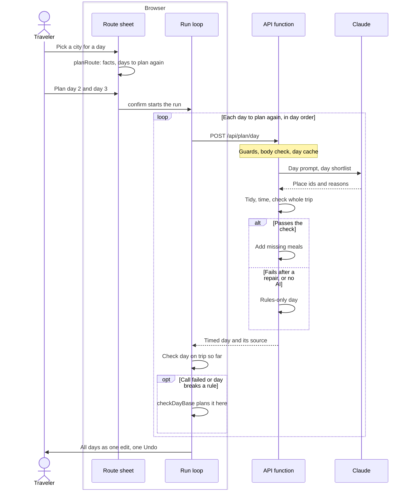

# Change cities

Once a trip is planned, the traveler can give any day another city, or set a city for every day, and only the days that need it are planned again. The route sheet states what each choice costs, such as the travel or a meal no place of the city can serve that day, before anything is sent. It then plans those days one request at a time and applies them as one edit with one Undo.

Map: [overview.md](overview.md). Detail: [reference.md, Day re-plan](reference.md#day-re-plan). Why: decisions [15](../decisions.md#15-re-plan-one-day-of-a-trip), [16](../decisions.md#16-a-city-a-day-set-by-hand) and [17](../decisions.md#17-a-missing-meal-says-why-a-city-warns-before-and-code-adds-the-meal-the-ai-left-out).

## Step by step

1. **Open.** The city on a day's line (`CityPill`, [DayTimetable.tsx](../../apps/web/components/DayTimetable.tsx)) calls `open` in [useDayRoute.ts](../../apps/web/lib/useDayRoute.ts), which opens [RouteSheet.tsx](../../apps/web/components/RouteSheet.tsx) on that day's cities with a draft route that starts as the trip's own.
2. **Judge each choice in the browser.** On every draft change [PlanView.tsx](../../apps/web/components/PlanView.tsx) recomputes `routeView` and `dayChoices` ([lib/dayRoute.ts](../../apps/web/lib/dayRoute.ts)), which call the planner's `planRoute` ([dayRoute.ts](../../packages/planner/src/dayRoute.ts)) for the route and `routeOptions` ([dayBases.ts](../../packages/planner/src/dayBases.ts)) for each city of the open day. No request is sent. The facts are the travel and the day's start (`dayTravel`), and each meal no place of the city can serve that date after the travel (`mealFacts`, [mealSupply.ts](../../packages/planner/src/mealSupply.ts)): "No dinner in Bologna on Mondays." A fact never refuses a city.
3. **Pick the days to plan again.** `planRoute` returns `replan` in day order, each day with a reason: `city` (its city changed), `travel` (its travel changed and the validator says its stops no longer fit) or `must_include` (it must now hold a place the traveler asked for, whose day moved). It proves the set by planning those days with the rules in day order (`planDay`) and validating the trip, and refuses a route only when a must-include would be lost or nothing fits a day, plus a last guard against a new validator error.
4. **Confirm.** The action ("Plan day 2 and day 3") calls `confirm`, which builds the run with `routeRun`. It starts from `routeStartDays`: each day to plan again empty at its new city, the others as they are.
5. **One request per day, in order.** The run loop, `runJobs` in useDayRoute.ts, builds each body with `jobBody` (lib/dayRoute.ts) and sends it with `requestDay` ([dayCity.ts](../../apps/web/lib/dayCity.ts)). Each carries the route and the trip as planned so far: the run's earlier days with their new stops, its later days empty. Editing and Undo wait until the run ends.
6. **Guard.** [routes/planDay.ts](../../services/api/src/routes/planDay.ts) runs the guards of `POST /api/plan` (origin check, the shared per-client rate limit, a 16 KB JSON body), then a strict ids-only body check (`planDayBodySchema`, [dayInput.ts](../../services/api/src/plan/dayInput.ts)) in which only a later day of the route may be empty. `checkDayBase` plans the rules-only day there, or the answer is 422 `day_not_allowed`. With the AI on, the day cache ([dayCache.ts](../../services/api/src/plan/dayCache.ts), keyed on the route too) may answer first.
7. **Plan the day.** `replanDay` ([replanDay.ts](../../services/api/src/plan/replanDay.ts)) runs the stages of [Plan my trip](plan-a-trip.md#step-by-step) for one day:
   - `buildDayShortlist` ([dayShortlist.ts](../../services/api/src/plan/dayShortlist.ts)) offers the city's places that fit that date, less every place on another day.
   - The model gets the `day-v2` prompt ([dayPrompt.ts](../../services/api/src/llm/dayPrompt.ts)) and returns ordered place ids with a reason each.
   - `tidyDay` and `materializeDay` ([dayTidy.ts](../../services/api/src/plan/dayTidy.ts)) tidy the answer, time the whole trip and check it.
   - If it passes, `withMealsAdded` ([mealAdd.ts](../../services/api/src/plan/mealAdd.ts)) adds a lunch or dinner the day lacks where `addMissingMeals` seats a shortlisted place, kept only if the day still passes.
   - If it fails, one repair turn (`LLM_MAX_ATTEMPTS` is 2). If that fails too, or the model does, the answer is the rules-only day (`rulesDay`).
8. **Check the answer on the page.** `resolveJob` (lib/dayRoute.ts) takes the API's day only if it is the day, city and date asked for, holds only known places, none repeated or on another day, adds no validator error (`newTripErrors`) and keeps every must-include the rules-only day holds (`mustIncludesLeftOut`). Otherwise the page plans the day with `checkDayBase`. Either way the day goes into the trip the next request carries.
9. **Apply.** The reducer's `replan` action ([itineraryReducer.ts](../../apps/web/lib/itineraryReducer.ts)) checks the trip is the one the run began from, puts every day in with `withReplannedDays` ([alternatives.ts](../../packages/planner/src/alternatives.ts)), and pushes one history entry, so one Undo takes the whole run back. It records how each day was made (`dayMade`) for the line under its heading.
10. **Keep.** The last plan in localStorage ([lastPlan.ts](../../apps/web/lib/lastPlan.ts)) keeps `dayMade`. A saved trip is rebuilt from ids by the server (`rebuildTrip`, [trips/rebuild.ts](../../services/api/src/trips/rebuild.ts)), which takes AI why lines only from its own records (the plan record, or the saved trip the page opened), so a day planned again shows the rules' why lines, and Copy link says so (`replannedNote`, [copyLink.ts](../../apps/web/lib/copyLink.ts)). More in [save-and-share.md](save-and-share.md).

## When something fails

- **The route would lose a must-include, or nothing fits a day.** The sheet shows the reason and the way out on that day, and the action stays dimmed.
- **The model fails, or its day still breaks a rule after the repair.** The server sends the rules-only day, and the day's line says why ("Planned again without AI: the AI's plan broke a rule").
- **The call fails:** offline, no answer in 28 s (`TIMEOUTS.plan`), any HTTP error (400 and 422 included) or an unreadable reply. The page plans that day on the device ("Planned again on this device: the server timed out"), and the rest of the run too without calling again; those days name the failed call ("the server timed out on day 2").
- **The answer fails the page's check.** The page plans the day on the device: "the server's day broke a rule".
- **The rules cannot plan the day either.** The run stops, no day is applied, and the page gives the reason and "Your trip was left as it was."
- **A new plan replaces the trip during the run.** The run is cancelled. A run that ends on a different trip is refused: "Your trip changed while it was planned, so it was left as it was."

## Where to change it

- **A new fact for a city or a day:** compute it in `planRoute` (its own field on `RouteDay`, as `meals` is) and in `checkWith` (dayBases.ts), copy it in `routeOption`, then show it in `routeView` and `dayChoices`; `dayChoices` splits an option's `warnings` by the lengths of `meals` and `others`. Invariant: a fact informs and never refuses.
- **Which days are planned again:** the pass loop in `planRoute` and `releaseIdle` (dayRoute.ts). Invariant: a day not in `replan` keeps its stops, and `replan` stays in day order, because each request carries the days before it and the server lets only later route days be empty.
- **The day pipeline:** dayShortlist.ts, dayPrompt.ts, dayTidy.ts, mealAdd.ts, replanDay.ts. Bump `DAY_PROMPT_VERSION` on any change to the prompt's wording, since it is part of the day cache key. Invariant: the returned day adds no error to the trip, and the rules-only day answers whenever the AI's cannot.
- **A new field in the day request:** `planDayBodySchema` and `dayInputOf` (dayInput.ts), `jobBody`, `PlanDayBody` ([api.ts](../../apps/web/lib/api.ts)), and `dayCacheKey` if it changes the answer. Invariant: the body stays strict and ids only, apart from the trip request itself.
