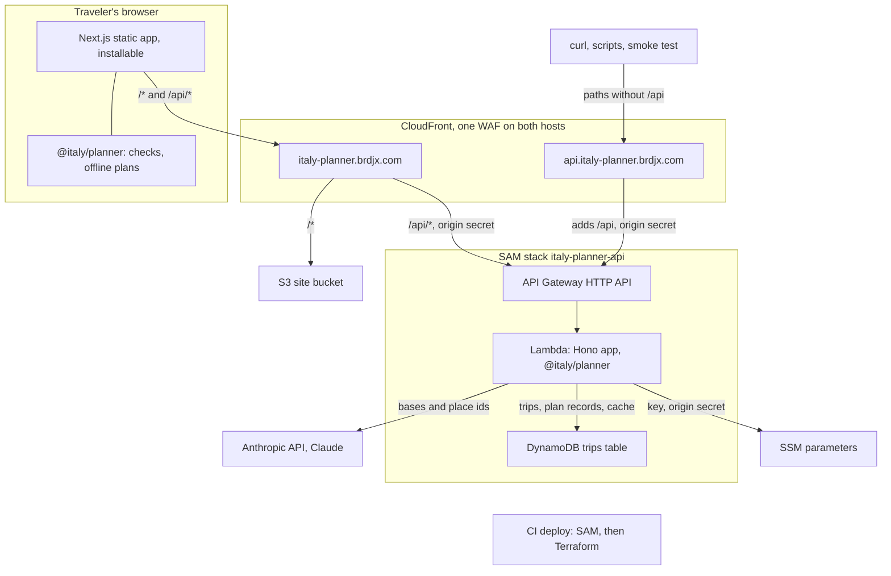

# System overview

The traveler picks a start date, a pace and a few preferences, and gets a three-day itinerary through Italy in which every stop has a time that fits its opening hours, the meals and the travel. The page is a static site that calls one API function; the function asks Claude which places to visit, then times and checks the plan in code. When the model, the API or the network fails, the traveler still gets a checked plan, labelled with how it was made.

The page calls only `/api/*` on its own host, so production needs no CORS. CloudFront adds the `x-origin-verify` header on both hosts and the function answers 403 without it, so nothing reaches the API around the WAF ([`lib/originVerify.ts`](../../services/api/src/lib/originVerify.ts)). The places come from `data/italy.json`, bundled into the Lambda and normalized once per process ([`data.ts`](../../services/api/src/data.ts)); the page loads them from `/api/places` into the same planner ([`tripData.ts`](../../apps/web/lib/tripData.ts)), so the browser and the function judge a plan by one set of rules. After CI passes on `main`, [`deploy.yml`](../../.github/workflows/deploy.yml) assumes the deploy role through OIDC, runs SAM, then Terraform, uploads the site to S3, invalidates CloudFront and runs a smoke test. More in [reference.md](reference.md#request-path) and [../deploy.md](../deploy.md#why-two-hostnames).

## Packages

| Path | What it owns |
|---|---|
| [`apps/web`](../../apps/web) | Next.js static export: the form, the plan, edits, the route sheet, share links. [`app/manifest.ts`](../../apps/web/app/manifest.ts) and a hand-written service worker, [`public/sw.js`](../../apps/web/public/sw.js), make it installable and usable offline. Every API call is in [`lib/api.ts`](../../apps/web/lib/api.ts). |
| [`services/api`](../../services/api) | The Hono app ([`src/app.ts`](../../services/api/src/app.ts)), served on Node by `local.ts` and on Lambda by `lambda.ts`. Routes in `src/routes`, the plan pipeline in `src/plan`, the model client in `src/llm`, saved trips in `src/trips`, limits, secrets and logging in `src/lib`. |
| [`packages/planner`](../../packages/planner) | TypeScript with no I/O: data normalization, travel, the scheduler (`scheduleTrip`), the validator (`validateItinerary`), the rules-only planner (`planDeterministic`), day and route checks. Runs in the Lambda and in the browser. |
| [`packages/evals`](../../packages/evals) | 16 cases, recorded model answers, and a runner that calls the production `planTrip` in process ([`src/pipeline.ts`](../../packages/evals/src/pipeline.ts)). |
| [`e2e`](../../e2e) | Playwright projects for phones, tablets, desktop and the service worker, plus a smoke run against the live site. [`serve.mjs`](../../e2e/serve.mjs) serves the static export and proxies `/api` the way CloudFront does. |
| [`infra`](../../infra) | `terraform/bootstrap` (CI roles, permissions boundary; applied by an admin), `terraform/platform` (certificate, DNS, bucket, both distributions, WAF, origin secret), `sam` (function, HTTP API, trips table, alarms), and `test`. |

## The core rule: the model proposes, code decides

Claude picks a base for each day and orders place ids from a shortlist code built, with a why line per stop and a summary; it never writes a time, a travel estimate or an opening hour ([`plan/candidates.ts`](../../services/api/src/plan/candidates.ts), [`llm/schema.ts`](../../services/api/src/llm/schema.ts)). Code tidies what the model cannot see, such as a place on its closed day, rejects any id it did not offer, times every stop with `scheduleTrip`, checks the plan with `validateItinerary`, and once it passes adds a lunch or dinner a day lacks where an offered meal place fits without moving a stop, checking again ([`plan/tidy.ts`](../../services/api/src/plan/tidy.ts), [`plan/materialize.ts`](../../services/api/src/plan/materialize.ts), [`plan/mealAdd.ts`](../../services/api/src/plan/mealAdd.ts)). A plan with any error never leaves the function: the model gets one repair turn, every other outcome ends in the rules-only plan behind a final guard ([`plan/planTrip.ts`](../../services/api/src/plan/planTrip.ts), [`plan/outcome.ts`](../../services/api/src/plan/outcome.ts); one day in [`plan/replanDay.ts`](../../services/api/src/plan/replanDay.ts)), and the page checks every plan it receives with the same validator ([`planRequest.ts`](../../apps/web/lib/planRequest.ts)).

Why: decisions [1](../decisions.md#1-the-model-proposes-code-decides) and [17](../decisions.md#17-a-missing-meal-says-why-a-city-warns-before-and-code-adds-the-meal-the-ai-left-out).

## Endpoints

| Endpoint | Answers with | Code |
|---|---|---|
| `GET /api/health` | ok, version, deployed commit, whether the AI is available, the model | [`app.ts`](../../services/api/src/app.ts) |
| `GET /api/meta` | bases, interests, paces, meal windows, request limits, the data fingerprint | `buildMeta` in [`routes/readPayloads.ts`](../../services/api/src/routes/readPayloads.ts) |
| `GET /api/places` | the normalized places with their data notes | `buildPlacesPayload`, same file |
| `GET /api/data-issues` | the normalizer's issues, excluded records and summary | `buildDataIssuesPayload`, same file |
| `POST /api/plan` | a three-day itinerary with its source, warnings and meta | [`routes/plan.ts`](../../services/api/src/routes/plan.ts), then `planTrip` |
| `POST /api/plan/day` | one day planned again at the city the traveler chose | [`routes/planDay.ts`](../../services/api/src/routes/planDay.ts), then `replanDay` |
| `POST /api/trips` | 201 and a short id, for a trip sent as place ids | [`routes/trips.ts`](../../services/api/src/routes/trips.ts) |
| `GET /api/trips/:id` | the saved trip exactly as stored | same file |

Any other method on these paths gets a 405 (`ROUTE_METHODS` in `app.ts`), any other path a JSON 404. On the API host the paths have no `/api` prefix; CloudFront adds it.

## When something fails

- **The model is slow, down or wrong.** Each call gets at most 15 s within a 24 s deadline. A timeout, a refusal, an API error or an answer still invalid after the repair ends in the rules-only plan (or day), never a 500, and the line under the dates says why: "Planned without AI: the AI planner timed out". A key SSM cannot return gives "Planned without AI: the AI planner is off".
- **The API is down, slow or rate limiting.** The page waits up to 28 s. With the places loaded it plans in the browser with the same rules-only planner, labelled "Planned on this device: the server failed" (or "timed out", "was busy"); a changed city gets the rules' day from `checkDayBase`. Without the places it shows the error with Try again.
- **The trips table is down or slow.** Plans still go out: the plan record waits at most 1 s, a cache read 150 ms and a cache write 500 ms, and a failure is only logged. Copy link copies the `?p=` link instead, which rebuilds the trip from its places, and says so. A `?t=` link shows "The saved trip could not be loaded. Check the connection and open the link again."
- **The device is offline.** The service worker serves the app and the places it cached on the first visit, the banner says "You are offline. New plans are made on this device, without AI.", and the last plan (kept 90 days) comes back. Before the places are cached, the banner asks the traveler to connect.

## Where to change it

- **A new endpoint.** Register it in `app.ts` or a file in `routes/`, add its path to `ROUTE_METHODS` and its response schema to [`contract.ts`](../../services/api/src/contract.ts), and add a client and Zod schema in [`lib/api.ts`](../../apps/web/lib/api.ts) and [`lib/apiSchemas.ts`](../../apps/web/lib/apiSchemas.ts). CloudFront's `/api/*` and the SAM route `ANY /api/{proxy+}` already reach it. Keep: a route that calls the model shares the plan rate limit bucket (`planRoutes` in `app.ts`) and needs its own throttle in [`template.yaml`](../../infra/sam/template.yaml) and a match in the WAF plan rule ([`waf.tf`](../../infra/terraform/platform/waf.tf)).
- **A new planning rule.** Add the check to the validator ([`validate.ts`](../../packages/planner/src/validate.ts), [`validate/`](../../packages/planner/src/validate)) and make the scheduler and the rules-only planner meet it; the API, the page and offline plans all pick it up. Keep: the validator never calls the scheduler, and the rules-only plan passes it for every request it can plan (else the API answers 503). A new violation code ([`enums.ts`](../../packages/planner/src/enums.ts), severity in [`violations.ts`](../../packages/planner/src/violations.ts)) is a contract change: a page loaded before the deploy rejects any plan carrying it.
- **A new kind of stored record.** Add a key prefix and a retention beside `planKey`, `tripKey`, `cacheKey` and `KEEP_SECONDS` in [`trips/store.ts`](../../services/api/src/trips/store.ts). Keep: records are written once with a conditional put, the function may only `GetItem` and `PutItem`, and the traveler's notes are never stored.
- **The infrastructure.** The edge is in [`infra/terraform/platform`](../../infra/terraform/platform); the function, HTTP API, table and alarms in [`infra/sam/template.yaml`](../../infra/sam/template.yaml). `python3 .github/scripts/check-infra-contract.py .` checks the names the deploy relies on. Keep: SAM deploys before Terraform (the platform reads the stack's output), and CI can update but not create or delete the HTTP API, the distributions or the certificate.

## Read next

- [plan-a-trip.md](plan-a-trip.md): how `POST /api/plan` turns a request into a checked plan.
- [change-cities.md](change-cities.md): a city a day, and planning one day again.
- [save-and-share.md](save-and-share.md): Copy link, the saved trip, opening a link, and the plan cache.
- [reference.md](reference.md): the detailed reference: pipelines, caches, security model, deploy topology.
- [../planner.md](../planner.md): the planner's rules.
- [../decisions.md](../decisions.md): each main choice, with the alternatives considered.
- [../deploy.md](../deploy.md): the AWS layout, the one-time admin steps and the CI deploy.
