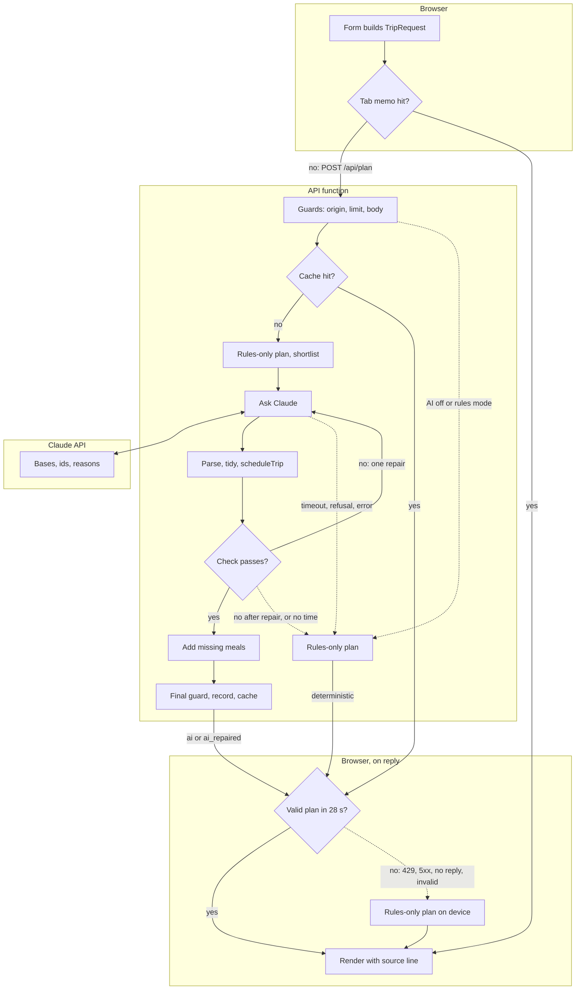

# Plan my trip

Plan my trip turns the form into a timed three-day itinerary. Claude picks each day's base and places from a shortlist code built; code times every stop, checks the plan and adds a meal the AI left out. When no valid AI answer is ready in time the traveler gets the rules-only plan, and a line under the trip's dates says how the plan was made.

Map: [overview.md](overview.md). Detail: [reference.md, Plan pipeline](reference.md#plan-pipeline) and [Plan cache](reference.md#plan-cache). Why: decisions [1](../decisions.md#1-the-model-proposes-code-decides), [5](../decisions.md#5-the-rules-only-planner-is-a-product-path), [6](../decisions.md#6-an-independent-validator), [14](../decisions.md#14-an-ai-plan-cache-in-three-layers-keyed-on-the-options) and [17](../decisions.md#17-a-missing-meal-says-why-a-city-warns-before-and-code-adds-the-meal-the-ai-left-out).

**Time budget.** 24 s from the request's arrival (`PLAN_DEADLINE_MS`), 1.5 s of it kept for the fallback (`DEFAULT_TIMING.reserveMs`). Each model call gets the lesser of 15 s (`LLM_TIMEOUT_MS`) and what the deadline leaves after the reserve; a first call needs 2 s left and a repair 4 s, so a repair after a 15 s first answer still gets 7.5 s. A brief failure (a dropped connection, a 5xx or 529, or a 429 asking to wait at most 1 s) gets one retry per request, after 0.4 s or the API's retry-after up to 1 s. The page waits 28 s, the function 29 s, API Gateway 30 s.

## Step by step

1. **Form.** `submit` in [TripForm.tsx](../../apps/web/components/TripForm.tsx) checks the fields; `toTripRequest` in [tripForm.ts](../../apps/web/lib/tripForm.ts) parses them with the planner's `TripRequestSchema`, which the API's schema builds on.
2. **Tab memo.** `planTrip` in [usePlanTrip.ts](../../apps/web/lib/usePlanTrip.ts) looks in the tab's `PlanMemo` ([planMemo.ts](../../apps/web/lib/planMemo.ts): 20 AI plans, keyed on the planner's `planRequestKey`); a hit shows at once. Otherwise `requestPlan` ([planRequest.ts](../../apps/web/lib/planRequest.ts)) calls `postPlan` ([api.ts](../../apps/web/lib/api.ts)); after 8 s the page says it is still working.
3. **Edge and guards.** CloudFront adds the `x-origin-verify` secret; the WAF allows an IP 30 calls to the plan routes per 5 minutes, and API Gateway 1 plan a second with a burst of 6. `originVerify` ([originVerify.ts](../../services/api/src/lib/originVerify.ts)) answers 403 without the secret. The route in [routes/plan.ts](../../services/api/src/routes/plan.ts) takes a token from the client's bucket ([rateLimit.ts](../../services/api/src/lib/rateLimit.ts): 10 a minute per instance, shared with day re-plans), reads the body with `readJsonBody` ([body.ts](../../services/api/src/lib/body.ts): JSON only, 16 KB) and parses it with `planRequestSchema`: strict, known interests, places and bases only.
4. **Cache.** With the AI layer on, `readCachedPlan` ([planCache.ts](../../services/api/src/plan/planCache.ts)) looks up `planCacheKey` ([cache.ts](../../services/api/src/lib/cache.ts): prompt version, model, commit, data fingerprint, request key) in this instance's memory (100 plans), then in the table for at most 150 ms (never for a request with notes). A hit answers with the request as sent now. The three cache layers are in [save-and-share.md](save-and-share.md#the-plan-cache).
5. **Shortlist.** For `?mode=deterministic` or with the AI layer off, `planTrip` ([planTrip.ts](../../services/api/src/plan/planTrip.ts)) returns the rules-only plan at once. Otherwise it makes that plan once with `planDeterministic` and keeps it for any fallback. `buildShortlist` ([candidates.ts](../../services/api/src/plan/candidates.ts)) offers the traveler's bases, or the 4 strongest when the planner chooses, plus any base the rules plan uses, each with enough visits and meal places for a whole trip there at the pace. `buildUserMessage` ([promptUser.ts](../../services/api/src/llm/promptUser.ts)) writes them as rows.
6. **Claude.** `runTurn` ([modelTurn.ts](../../services/api/src/plan/modelTurn.ts)) gives the call its time and `callWithin` ([callWithin.ts](../../services/api/src/plan/callWithin.ts)) cuts it off there. `select` in [anthropic.ts](../../services/api/src/llm/anthropic.ts) asks with structured outputs for a base id per day, ordered place ids and a reason per stop, plus a summary: no times. `toResult` leaves a refusal or a cut-off answer unparsed; `parseSelectionText` ([schema.ts](../../services/api/src/llm/schema.ts)) parses the rest with Zod.
7. **Tidy.** `tidySelection` ([tidy.ts](../../services/api/src/plan/tidy.ts)) drops a place closed that day, repeats and second places at one spot, visits over the pace's limit or past the day's hours, and over-budget meal places timed as visits; reorders a day the scheduler cannot time; puts back drops that fit after all; and moves dropped places to another day at the same base. It never changes a base, adds a place or drops a needed meal, and keeps each must-include in the answer on one of its days.
8. **Time and check.** `materializeSelection` ([materialize.ts](../../services/api/src/plan/materialize.ts)) times every stop with `scheduleTrip` ([trip.ts](../../packages/planner/src/trip.ts)) and collects the errors: ids or bases outside the shortlist (`shortlistViolations`), stops the scheduler cannot time, and the independent `validateItinerary` ([validate.ts](../../packages/planner/src/validate.ts)). An AI reason is kept only when `checkAiReason` ([reasons.ts](../../services/api/src/plan/reasons.ts), guards in [textGuards.ts](../../services/api/src/plan/textGuards.ts)) and the planner's `contradictedClaim` pass it; otherwise the stop keeps the rule's why line. `sanitizeSummary` ([summary.ts](../../services/api/src/plan/summary.ts)) screens the summary.
9. **Meals** (decision 17). With no errors, `withMealsAdded` ([mealAdd.ts](../../services/api/src/plan/mealAdd.ts)) asks the planner's `addMissingMeals` ([mealFill.ts](../../packages/planner/src/mealFill.ts)) for each lunch or dinner a day lacks, from shortlisted places only. It only inserts: no stop is dropped and each keeps its order and role. A day's meals stay only when the plan, timed and checked again, has no error and no new warning but the added place's own (`keptPlan`). The added stop has the rule's why line.
10. **Repair or fall back.** An off-schema answer, or one with errors, gets one repair turn if 4 s are left: it goes back with the exact violations and what tidying removed (`repairNotes` in [repairNotes.ts](../../services/api/src/plan/repairNotes.ts), `buildRepairMessage` in [prompt.ts](../../services/api/src/llm/prompt.ts)), and the new answer goes through steps 6 to 9. A refusal or a cut-off answer gets none. Every other ending calls `planWithoutAi` ([outcome.ts](../../services/api/src/plan/outcome.ts)), which returns the plan from step 5 with `meta.fallbackReason` set.
11. **Label, guard, keep.** `runModel` in planTrip.ts labels a plan `ai` only when it is the first answer used exactly as written, else `ai_repaired`. `passesGuard` in outcome.ts (zero validator errors, valid response schema) runs on every plan: an AI plan that fails it (a bug) becomes the rules-only plan, and a rules-only plan that fails it a 503. For an AI plan the route then calls `keepAiPlan` ([keepPlan.ts](../../services/api/src/trips/keepPlan.ts): the AI content kept 90 days, at most 1 s wait, its `planId` lets a [saved trip](save-and-share.md) keep the AI's why lines) and `cachePlan` (memory, and with a `planId` and no notes the table for 7 days, at most 500 ms wait).
12. **Page.** `postPlan` parses the reply with `ItinerarySchema`, and once the places have loaded `requestPlan` checks it with the planner's `validationErrors`. `usePlanTrip` keeps an AI plan in the memo and dispatches `plan` to [itineraryReducer.ts](../../apps/web/lib/itineraryReducer.ts). [SourceBadge.tsx](../../apps/web/components/SourceBadge.tsx) in the trip summary shows the source line from `sourceText` ([sourceText.ts](../../apps/web/lib/sourceText.ts)): "Planned with AI", "Planned with AI, fixed after a check", or "Planned without AI" with the reason.

## When something fails

- **The form refuses a field:** that field's message, and nothing is sent.
- **The API refuses the request (400, 413, 415) or no plan fits (422):** "Some trip details were not accepted. Check the form, then try again." (naming the fields when the API did), no Try again, and the previous plan stays.
- **The AI path gives up:** the rules-only plan, "Planned without AI:" and then "the AI planner timed out" (a call ran out of time, or no time was left for a first call or for repairing an invalid answer), "was busy" (a 429 or 529), "declined" (a refusal), "the AI's plan broke a rule" (the repaired answer still fails), or "failed" (a cut-off answer, an off-schema answer with no time to repair it, any other error).
- **The AI layer is off or has no key:** the rules-only plan, "Planned without AI: the AI planner is off".
- **A cache read or write, or the plan record, fails:** the plan still goes out; only the log shows it. Without a record the plan has no `planId`, so a trip saved from it carries the rules' why lines.
- **The server cannot answer:** the page plans with the rules on the device, "Planned on this device:" and then "the server was busy" (a 429 from the WAF, the gateway or the bucket), "the server failed" (a 5xx), "the server timed out" (no answer in 28 s) or "the reply was unreadable"; with no connection, "Planned on this device, offline". Before the places have loaded it shows a message with Try again instead.
- **The API's plan fails the page's check:** a plan on this device, "the server's plan broke a rule". A rules-only plan that fails the API's guard arrives as a 503: "the server failed".

## Where to change it

- **A new form option:** `TripRequest` ([types.ts](../../packages/planner/src/types.ts)) and `TripRequestSchema` ([schemas.ts](../../packages/planner/src/schemas.ts)), `toTripRequest` and `valuesFromRequest` in tripForm.ts, and `canonicalPlanRequest` ([requestKey.ts](../../packages/planner/src/requestKey.ts)). Keep one schema for the form and the API, and put the option in the key, or the memo and the cache serve plans made without it.
- **What the model sees or answers:** `SHORTLIST` and `buildShortlist` in candidates.ts, the prompts in prompt.ts and promptUser.ts, and `SelectionSchema` with `SELECTION_JSON_SCHEMA` in schema.ts (a test keeps the two alike). Raise `PROMPT_VERSION` on any wording change (it is in the cache key and every eval result) and replay the recorded answers with `pnpm eval:replay`. The model picks only offered ids and never sends a time.
- **A new plan rule:** the validator ([validate.ts](../../packages/planner/src/validate.ts) and [validate/](../../packages/planner/src/validate/)), with its code in `VIOLATION_CODES` ([enums.ts](../../packages/planner/src/enums.ts)) and `VIOLATION_SEVERITY` ([violations.ts](../../packages/planner/src/violations.ts)). The API, the page and the rules-only planner all run it, and the rules-only planner must never break it, or its fallbacks become 503s. A page loaded before the deploy reads a plan with a new code as unreadable.
- **A change code makes to an answer:** a step in `tidySelection` with its `TidyRule`, and what the repair turn is told in repairNotes.ts. Never change a base or drop a needed meal, and keep each must-include on one of its days. Add a place only in mealAdd.ts, and label any changed plan `ai_repaired`.
- **Time limits:** `LLM_TIMEOUT_MS`, `PLAN_DEADLINE_MS` and `LLM_MAX_ATTEMPTS` (2, so one repair) in [config.ts](../../services/api/src/config.ts) and [template.yaml](../../infra/sam/template.yaml), `DEFAULT_TIMING` in modelTurn.ts, and `TIMEOUTS.plan` in api.ts. The deadline stays at most 26 s (`MAX_PLAN_DEADLINE_MS`), under the page's 28 s and the function's 29 s.
