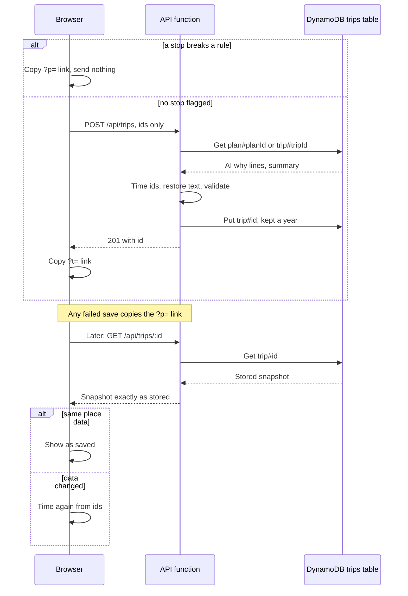
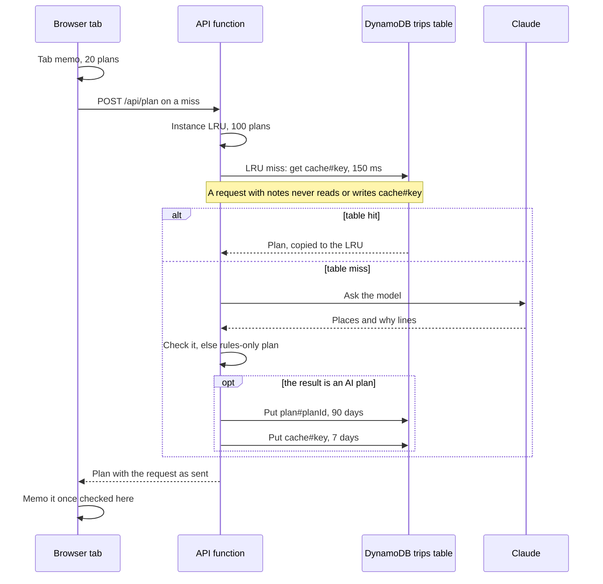

# Save and share

Copy link turns the plan on screen into a short `?t=` link that anyone can open. The server saves a trip only from ids it times and checks itself, and takes the AI's words only from its own records, so a link can never carry text a stranger wrote. The same table holds the plan cache, so options already planned come back at once, without another model call.

Map: [overview.md](overview.md). Detail: [reference.md, Saved trips](reference.md#saved-trips) and [Plan cache](reference.md#plan-cache). Why: decisions [12](../decisions.md#12-saved-trips-one-dynamodb-table-and-a-short-link-opened-as-saved), [13](../decisions.md#13-the-travelers-notes-stay-out-of-saved-trips) and [14](../decisions.md#14-an-ai-plan-cache-in-three-layers-keyed-on-the-options).

## Save and open

## The plan cache

## Step by step

Saving a trip:

1. `useShareLink` ([ShareButton.tsx](../../apps/web/components/ShareButton.tsx)) builds the body with `saveTripBody` ([savedTrip.ts](../../apps/web/lib/savedTrip.ts)): the request without notes, each day's `anchorId` and place `ids`, and the plan's `planId` or the `tripId` it was opened from. `copySavedLink` ([copyLink.ts](../../apps/web/lib/copyLink.ts)) starts the clipboard write inside the press, the link still a promise, so Safari keeps the gesture.
2. The gateway throttles `POST /api/trips` to 2 a second, burst 10 ([template.yaml](../../infra/sam/template.yaml)). The route in [routes/trips.ts](../../services/api/src/routes/trips.ts) allows 20 saves a minute per client per instance and a 16 KB body, then `saveTripSchema` checks it: strict, known bases and places, 3 days, at most 20 stops a day.
3. `loadSource` reads `plan#<planId>` or `trip#<tripId>`. `rebuildTrip` ([trips/rebuild.ts](../../services/api/src/trips/rebuild.ts)) uses that record only when `samePlanRequest` holds, times the ids with `scheduleTrip`, and puts a stored why line back where the same place keeps its role on the same day and passes `checkAiReason` and `attachReasons` again. The summary stays only while every day keeps its base, after `summaryForPlaces` and `sanitizeSummary`. A meal that code added to an AI plan ([decision 17](../decisions.md#17-a-missing-meal-says-why-a-city-warns-before-and-code-adds-the-meal-the-ai-left-out)) has no AI why line on record, so it keeps the rule's.
4. The scheduler's violations, `validateItinerary` and `ItinerarySchema` check the result; any error is a 422 `trip_not_valid`.
5. `saveNew` ([trips/store.ts](../../services/api/src/trips/store.ts)) writes the snapshot (itinerary, origin, `dataVersion`, `createdAt`, `expiresAt`) under `trip#<id>` for a year (`KEEP_SECONDS.trip`). The id is 10 base62 characters from `newRecordId` ([trips/ids.ts](../../services/api/src/trips/ids.ts)); the put is conditional, so a taken id tries another, 3 tries in all. The answer is 201 `{ id }`, and the page copies `?t=<id>`.
6. Notes never reach the table. Requests are stored without them, and `planRecordFrom` ([trips/records.ts](../../services/api/src/trips/records.ts)) keeps no AI text for a plan made with notes; the page says so on copy (`privateAiText`).

Opening a link:

7. `useSavedTripOnLoad` ([useSavedTrip.ts](../../apps/web/lib/useSavedTrip.ts)) reads `?t=`, and `loadSavedTrip` starts `GET /api/trips/<id>` at once, while the places load. `openTrip` in routes/trips.ts returns the stored text as it is, cacheable for 5 minutes.
8. `openSavedTrip` (savedTrip.ts) compares the snapshot's `dataVersion` with the fingerprint of the loaded places. Equal: the trip shows as saved. Different: `rebuildShared` ([shareLink.ts](../../apps/web/lib/shareLink.ts)) times its ids again, with the rules' why lines and a note. The reducer ([itineraryReducer.ts](../../apps/web/lib/itineraryReducer.ts)) runs the validator on it, as on every plan.
9. The fallback `?p=` link (`shareUrl` in shareLink.ts) is base64url JSON of the request without notes and each day's ids. `decodeShare` refuses one over 8,192 characters, and `rebuildValid` ([shareRebuild.ts](../../apps/web/lib/shareRebuild.ts)) leaves out the stops the validator flags until the trip is clean.

The plan cache:

10. `usePlanTrip` ([usePlanTrip.ts](../../apps/web/lib/usePlanTrip.ts)) asks its `PlanMemo` ([planMemo.ts](../../apps/web/lib/planMemo.ts)) first: up to 20 AI plans in the tab's memory, each kept only once this browser has checked it, gone on reload.
11. The plan route ([routes/plan.ts](../../services/api/src/routes/plan.ts)) builds `planCacheKey` ([lib/cache.ts](../../services/api/src/lib/cache.ts)): SHA-256 of the prompt version, the model, the deployed commit, the data fingerprint and `planRequestKey` ([requestKey.ts](../../packages/planner/src/requestKey.ts)), which sorts interests, must-includes and skips, and keeps bases in order and notes as typed.
12. `readCachedPlan` ([plan/planCache.ts](../../services/api/src/plan/planCache.ts)) tries the instance `LruCache` (100 plans), then, for a request without notes, `cache#<key>` in the table within 150 ms. The route answers any hit with `{ ...cached, request }`, the request as sent now.
13. On a miss that ends in an AI plan (steps 5 to 11 of [Plan my trip](plan-a-trip.md#step-by-step)), `keepAiPlan` ([trips/keepPlan.ts](../../services/api/src/trips/keepPlan.ts)) writes `plan#<planId>` for 90 days, then `cachePlan` keeps the plan in memory and, when it has a `planId` and no notes, in the table for 7 days. Rules-only plans, `?mode=deterministic` and plans made on the device are never cached.

## When something fails

- A stop breaks a rule: nothing is sent. The `?p=` link is copied, and the note says the plan is not saved and the link leaves out stops that still break a rule.
- The save fails for any reason (offline, 422, 429, 503): the `?p=` link is copied, and the note says the saved link could not be made.
- The clipboard refuses: the link shows in a field to copy by hand.
- The plan record is missing, expired or unreadable, or the options changed since the AI planned: the trip still saves, with the rules' why lines. Days [planned again](change-cities.md) get them too, and the note names those days.
- An unknown or expired `?t=` id: 404, and "This saved trip could not be found" over the form. A malformed id gets the same note without a request.
- A network or server failure on open: "Check the connection and open the link again", with `?t=` kept so a reload tries again.
- A saved trip that no longer fits the data: its settings fill the form, to plan again.
- A cache read that fails or passes 150 ms is a miss. A plan record not written within 1 s: the plan goes out without a `planId`, stays out of the table cache, and saves with rule why lines.

## Where to change it

- A new field on a saved trip: `TripSnapshotSchema` in [contract.ts](../../services/api/src/contract.ts), the `snapshot` in `saveTrip`, and `SavedTripSchema` in [apiSchemas.ts](../../apps/web/lib/apiSchemas.ts). `openTrip` re-reads each stored trip with `TripSnapshotSchema` and trips live a year, so the field must be optional or older links answer 500.
- New AI text on saved trips: `PlanRecordSchema`, `planRecordFrom` and `AiSource` in trips/records.ts, re-checked in `rebuildTrip`. It must come from the table, never the POST body, and be left out when `hasNotes`.
- A new trip option: add it to `canonicalPlanRequest` (requestKey.ts) and to `samePlanRequest` (trips/rebuild.ts). Both name each field: an option missing from the first serves one option's cached plan for another, and one missing from the second puts AI why lines on a trip they were not written for.
- Lifetimes: `KEEP_SECONDS` in trips/store.ts. A cached plan must not outlive its plan record, so its `planId` always resolves, and the plan record matches the page's `LAST_PLAN_MAX_AGE_DAYS`; [tripStore.test.ts](../../services/api/test/unit/tripStore.test.ts) holds both.
- A new cache on the table: follow [plan/dayCache.ts](../../services/api/src/plan/dayCache.ts), which reuses `readStore` and `writeStore` and starts its key text with its own tag, `"day"`. Cache only AI results, keep the commit in the key, and keep requests with notes out of the table.
